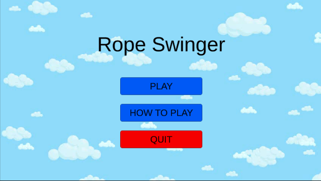

# Rope-Swinger

An online multiplayer Unity game where you race against other players to reach the end of the level by swinging between buildings.\
Levels are randomly generated and physics created manually using verlet integration.

